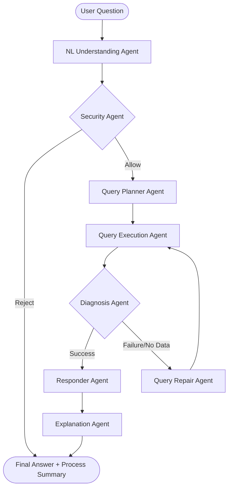

# NCU Regulation Multi-Agent QA System

This project is an extension of Assignment 4, implementing a multi-agent architecture for querying NCU (National Central University) regulations.

## Architecture Diagram



## Agent Responsibilities

1.  **NLUnderstandingAgent**: Parses natural language into structured `Intent` (type, keywords, aspect).
2.  **SecurityAgent**: Validates requests against safety policies (prompt injection, data dumping).
3.  **QueryPlannerAgent**: Formulates retrieval strategies (typed search vs. broad search).
4.  **QueryExecutionAgent**: Executes read-only queries on Neo4j/SQLite.
5.  **DiagnosisAgent**: Evaluates if retrieved data is sufficient.
6.  **QueryRepairAgent**: Broadens or simplifies queries if initial retrieval fails.
7.  **ResponderAgent**: Synthesizes a grounded answer from evidence.
8.  **ExplanationAgent**: Summarizes the agentic workflow for the user.

## Multi-Agent Pipeline

The system follows a structured pipeline:
- **Phase 1: Validation**: Understand the query and check for safety violations.
- **Phase 2: Retrieval**: Plan and execute KG queries. If the results are poor, a **Repair Loop** is triggered to broaden the search.
- **Phase 3: Synthesis**: Generate a final answer grounded in the retrieved rules and articles, then explain the process.

## Challenges & Findings

### Challenges
- **Authentication Issues**: Encountered Neo4j connection errors due to environment configuration. Resolved by ensuring consistent `.env` settings.
- **Model Loading**: Loading local LLMs (Qwen 2.5-3B) requires significant GPU/CPU resources. Optimized using `torch.float16` where available.
- **Ambiguity Handling**: Some questions are vague (e.g., "What happens if I'm late?"). The NLU agent must detect this and the Repair agent must try to find general rules.

### Findings
- **Multi-agent modularity**: Breaking down the system into specialized agents makes debugging significantly easier compared to a monolithic pipeline.
- **Security Validation**: Simple keyword-based security is fast, but LLM-based validation is necessary for sophisticated prompt injection attempts.
- **Repair Success**: Broadening keyword search during repair significantly improves recall for non-standard phrasing.

## Setup & Execution

### Requirements
- Python 3.11
- Neo4j (Docker)
- `uv` for environment management

### Commands
```bash
# Set up environment
uv venv --python 3.11
uv pip install -r requirements.txt

# Build KG
python build_kg.py

# Run Auto Test
python auto_test_a5.py
```
