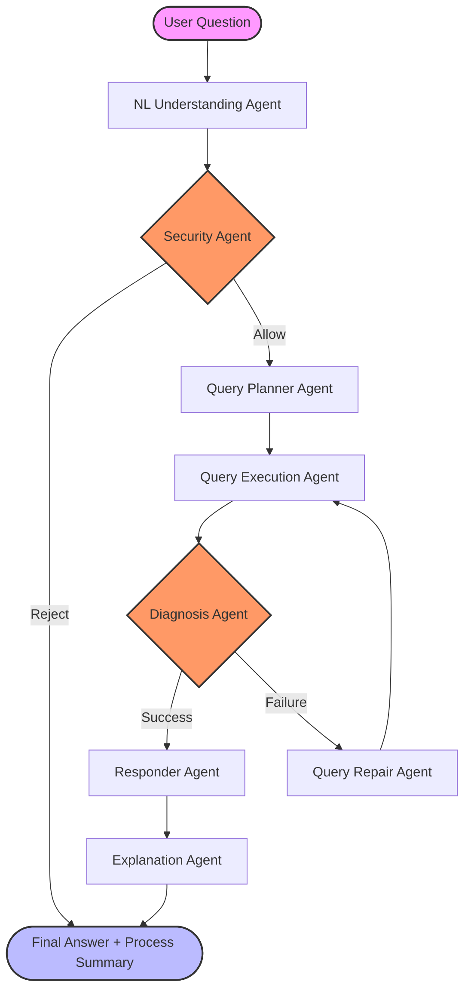

# NCU Regulation Multi-Agent QA System

**Name:** Robby Arifandri  
**Student ID:** 114522602

[](https://www.python.org/downloads/release/python-3110/)
[](https://neo4j.com/)
[](https://opensource.org/licenses/MIT)

An advanced agentic system designed to query and reason over **National Central University (NCU) Regulations** using a Knowledge Graph-backed Multi-Agent Architecture.

---

## Overview

This system leverages a specialized multi-agent pipeline to provide accurate, grounded, and secure answers to complex questions regarding university regulations. By decomposing the QA task into specialized roles, the system achieves higher reliability and transparency than traditional RAG approaches.

### Key Features
- **Intelligent Retrieval**: Combines Cypher queries on Neo4j with semantic search.
- **Self-Healing Pipeline**: Automatic query repair loop if initial retrieval fails.
- **Security First**: Integrated security agent to prevent prompt injection and data exfiltration.
- **Process Transparency**: Explanation agent provides a summary of the reasoning steps.

---

## Architecture

The system follows a sophisticated agentic workflow:



### Agent Roles & Responsibilities

| Agent | Responsibility |
| :--- | :--- |
| **NL Understanding** | Parses natural language into structured `Intent` (type, keywords, aspect). |
| **Security** | Validates requests against safety policies (prompt injection, data dumping). |
| **Query Planner** | Formulates retrieval strategies (typed search vs. broad search). |
| **Query Execution** | Executes read-only queries on Neo4j/SQLite. |
| **Diagnosis** | Evaluates if retrieved data is sufficient to answer the question. |
| **Query Repair** | Broadens or simplifies queries if initial retrieval fails. |
| **Responder** | Synthesizes a grounded answer from the retrieved evidence. |
| **Explanation** | Summarizes the internal agentic workflow for the end user. |

---

## Getting Started

### Prerequisites
- **Python**: 3.11+
- **Neo4j**: Running instance (local or Docker)
- **Environment**: `.env` file with necessary API keys and database credentials.

### Installation

1. **Clone the repository**
   ```bash
   git clone <repository-url>
   cd ncu-regulation-kg-qa
   ```

2. **Set up the environment using `uv`** (recommended)
   ```bash
   uv venv --python 3.11
   source .venv/bin/activate  # On Windows: .venv\Scripts\activate
   uv pip install -r requirements.txt
   ```

3. **Configure Environment**
   Create a `.env` file in the root directory:
   ```env
   NEO4J_URI=bolt://localhost:7687
   NEO4J_USER=neo4j
   NEO4J_PASSWORD=your_password
   OPENAI_API_KEY=your_key  # Or other LLM provider
   ```

### Running the System

- **Build the Knowledge Graph**:
  ```bash
  python build_kg.py
  ```

- **Run the Evaluation Suite**:
  ```bash
  python auto_test_a5.py
  ```

---

## Challenges & Performance

### Key Findings
- **Modularity**: Specialized agents allow for isolated testing and targeted improvements.
- **Recall**: The repair loop significantly improves accuracy for vague or complex queries.
- **Safety**: Multi-layered validation (Keyword + LLM) provides robust protection against malicious prompts.

### Current Challenges
- **Latency**: Sequential agent calls can be slow; investigating parallelization for non-dependent tasks.
- **Context Limits**: Managing long retrieval results within LLM context windows.

---

## License
Distributed under the MIT License. See `LICENSE` for more information.

---
*Created for the NCU Agentic AI Course.*
